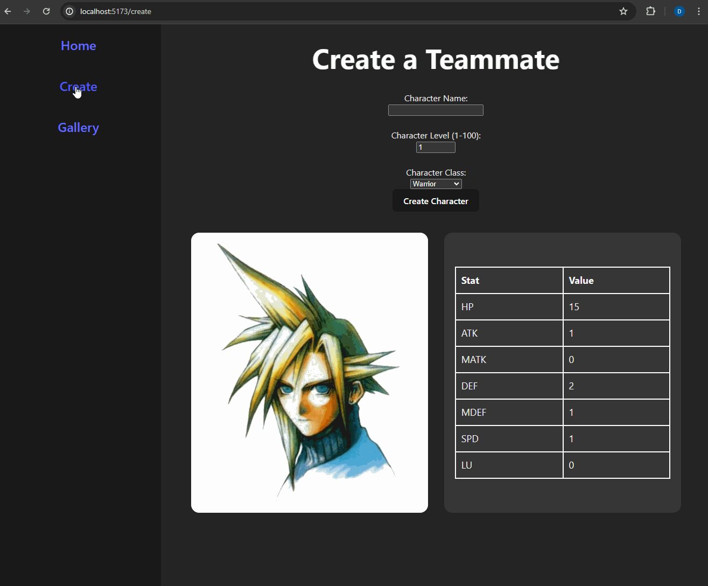

# Web Development Project 7 - Final Fantasy Team Builder

Submitted by: Diego Navarro

This web app: Users are able to create and manage their own team of Final Fantasy characters utilizing Supabase.

Time spent: 11 hours spent in total

## Required Features

The following **required** functionality is completed:

- [x] **A create form allows users to add new cremates**
- [x] **Users can name the crewmate and set the crewmate's attributes by clicking on one of several values**
- [x] **The site displays a summary page of all the user's added crewmates**
- [x] **A previously created crewmate can be updated from the crewmate list**
- [x] **A previously created crewmate can be deleted from the crewmate list**
- [x] **Each crewmate has a direct, unique link to an info page about them**

The following **optional** features are implemented:

- [ ] A crewmate can be given a category upon creation which restricts their attributes
- [ ] The site displays summary statistics about a user's crew on their crew page
- [ ] The site displays a custom "success" metric about a user's crew which changes the look of the crewmate list

The following **additional** features are implemented:

- [x] Stats of each character change depending on the level of the character

## Video Walkthrough

Here's a walkthrough of implemented user stories:

GIF created with LiceCAP

## Notes

Describe any challenges encountered while building the app.

By far the biggest challenge was figuring out how to set up Supabase. The main challenge was trying to get a post request to work. Eventually after some research I realized that I needed to add permission policies in order for users to start using the database. By default the data base is entirely restricted.

## License

    Copyright 2024 Diego Navarro

    Licensed under the Apache License, Version 2.0 (the "License");
    you may not use this file except in compliance with the License.
    You may obtain a copy of the License at

        http://www.apache.org/licenses/LICENSE-2.0

    Unless required by applicable law or agreed to in writing, software
    distributed under the License is distributed on an "AS IS" BASIS,
    WITHOUT WARRANTIES OR CONDITIONS OF ANY KIND, either express or implied.
    See the License for the specific language governing permissions and
    limitations under the License.
